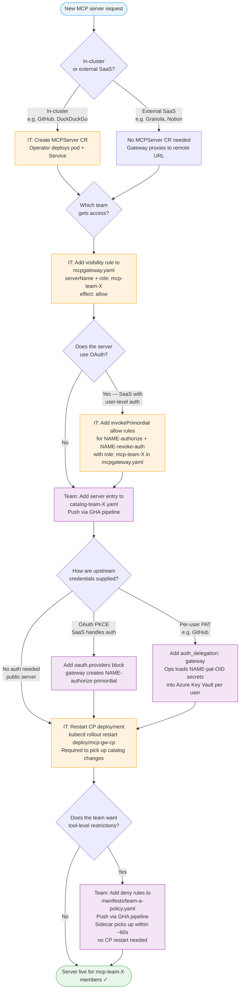

# Onboarding a New MCP Server

Decision flow for adding a server under the group-based access model.
**IT** owns the MCPGateway CR and MCPServer CRs. **Teams** own their catalog and policy ConfigMaps.

## Actor legend

| Color | Owner | What they control |
|-------|-------|-------------------|
| Orange | IT / central ops | MCPGateway CR, MCPServer CRs, CP restarts |
| Purple | Team | Catalog ConfigMap, policy ConfigMap, GHA pipeline |

## Key rules

- **MCPGateway CR is flip-to-deny.** A server is invisible unless an explicit `allow` rule exists for it.
- **Catalog changes need a CP restart.** The control plane reads the catalog at startup.
- **Policy changes do not.** The sidecar re-reads `/etc/mcp-policy/` on every call (kubelet syncs the ConfigMap volume within ~60s).
- **Teams can only deny, not grant.** Their policy layer runs after the MCPGateway CR allows the request — it can add restrictions, not bypass server visibility.
