# Onboarding a New MCP Server

## File reference

Each file touched during onboarding, who owns it, and why.

**IT-owned**

| File | Purpose |
|------|---------|
| `mcpgateway.yaml` | Server visibility rules — flip-to-deny policy engine that controls which teams see which servers and which OAuth primordials they can invoke |
| `mcpenvironment.yaml` | Binds one or more catalog ConfigMaps into the gateway runtime; the gateway CP reads this at startup to know which catalogs to load |
| `manifests/rbac-pipeline.yaml` | Creates the `team-X-pipeline` ServiceAccount with scoped RBAC (MCPServer CRUD + ConfigMap patch); the GHA pipeline authenticates as this SA — _specific to this PoV implementation_ |

**Team-owned**

| File | Purpose |
|------|---------|
| `catalog-team-X.yaml` | Server connection details for this team's servers: URL, transport type, auth config, OAuth provider, allowed hosts |
| `manifests/mcpserver-team-X-NAME.yaml` | MCPServer CR for in-cluster servers only; the operator watches these and creates a pod + Service for each one |
| `manifests/team-X-policy.yaml` | Tool-level deny rules read by the sidecar's `evaluate_policy` tool; runs after the MCPGateway CR allows the request — teams can restrict tools but cannot grant access |

---

## Actor legend

| Color | Owner | What they control |
|-------|-------|-------------------|
| Amber | IT / central ops | Entra setup, MCPGateway CR, MCPEnvironment, pipeline RBAC |
| Pink | Team | MCPServer CRs, catalog ConfigMap, policy ConfigMap, GHA pipeline pushes |
| Dark blue | — | Steps specific to this PoV guide |

---

## Flow

```mermaid
flowchart TD
    START([New MCP server request]) --> NEWTEAM{New team or\nexisting team?}

    NEWTEAM -->|New team| E1[Create Entra App Role mcp-team-X\nin Azure app registration]
    E1 --> E2[Create Entra Security Group\nAdd users to group\nAssign group to app role]
    E2 --> E3[Create catalog-team-X.yaml ConfigMap\nUpdate mcpenvironment.yaml to reference it]
    E3 --> E4[Apply pipeline RBAC\nMint team-X-pipeline SA token\nAdd OCP_SERVER + OCP_TOKEN_TEAM_X\nto GitHub Actions secrets]
    E4 --> GW
    NEWTEAM -->|Existing team| GW

    GW[Add visibility rule to mcpgateway.yaml\nserverName + role: mcp-team-X + effect: allow]
    GW --> OAUTH{Server uses OAuth\ne.g. Granola, Notion?}
    OAUTH -->|Yes| PRIM[Add invokePrimordial allow rules\nfor NAME-authorize + NAME-revoke-auth\nwith role: mcp-team-X in mcpgateway.yaml]
    OAUTH -->|No| HANDOFF
    PRIM --> HANDOFF

    HANDOFF([ ── IT complete — team takes over ── ])

    HANDOFF --> LOC{In-cluster or\nexternal SaaS?}
    LOC -->|In-cluster\ne.g. GitHub, DuckDuckGo| MCR[Create MCPServer CR\nmcpserver-team-X-NAME.yaml\nOperator deploys pod + Service]
    LOC -->|External SaaS\ne.g. Granola, Notion| CAT
    MCR --> CAT

    CAT[Add server entry to catalog-team-X.yaml]

    CAT --> CREDS{Credentials?}
    CREDS -->|OAuth PKCE| OA[Add oauth.providers block\ngateway creates NAME-authorize primordial]
    CREDS -->|Per-user PAT| PAT[Add auth_delegation: gateway\nLoad NAME-pat-OID secrets\ninto Azure Key Vault per user]
    CREDS -->|None — public server| PUSH

    OA --> PUSH
    PAT --> PUSH

    PUSH[Push via GHA pipeline\nPipeline handles CP restart automatically]

    PUSH --> RESTRICT{Tool-level\nrestrictions needed?}
    RESTRICT -->|Yes| POL[Add deny rules to\nteam-X-policy.yaml\nPush via GHA pipeline\nSidecar picks up within ~60s]
    RESTRICT -->|No| DONE
    POL --> DONE

    DONE([Server live for mcp-team-X members ✓])

    style START fill:#e8f4f8,stroke:#2196F3,color:#000000
    style DONE fill:#e8f5e9,stroke:#4CAF50,color:#000000
    style HANDOFF fill:#f5f5f5,stroke:#9E9E9E,color:#555555

    style E1 fill:#fff3e0,stroke:#FF9800,color:#000000
    style E2 fill:#fff3e0,stroke:#FF9800,color:#000000
    style E3 fill:#fff3e0,stroke:#FF9800,color:#000000
    style E4 fill:#1565C0,stroke:#0D47A1,color:#ffffff
    style GW fill:#fff3e0,stroke:#FF9800,color:#000000
    style PRIM fill:#fff3e0,stroke:#FF9800,color:#000000

    style MCR fill:#f3e5f5,stroke:#9C27B0,color:#000000
    style CAT fill:#f3e5f5,stroke:#9C27B0,color:#000000
    style OA fill:#f3e5f5,stroke:#9C27B0,color:#000000
    style PAT fill:#f3e5f5,stroke:#9C27B0,color:#000000
    style PUSH fill:#f3e5f5,stroke:#9C27B0,color:#000000
    style POL fill:#f3e5f5,stroke:#9C27B0,color:#000000
```

## Key rules

- **MCPGateway CR is flip-to-deny.** A server is invisible unless an explicit `allow` rule exists for it.
- **Catalog changes need a CP restart.** The control plane reads the catalog at startup — the GHA pipeline handles this automatically.
- **Policy changes do not need a restart.** The sidecar re-reads `/etc/mcp-policy/` on every call; the kubelet syncs the ConfigMap volume within ~60s.
- **Teams can only deny, not grant.** The sidecar policy layer runs after the MCPGateway CR allows the request.
- **MCPServer names must be prefixed** with the team name (e.g. `team-a-granola`) — the pipeline SA token enforces this via RBAC.
- **Order is flexible.** IT can complete their steps independently of the team; the MCPGateway CR does not validate that a referenced MCPServer exists.
